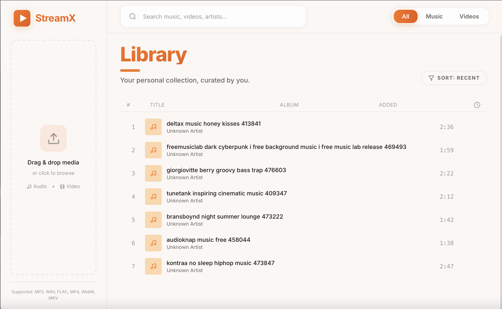
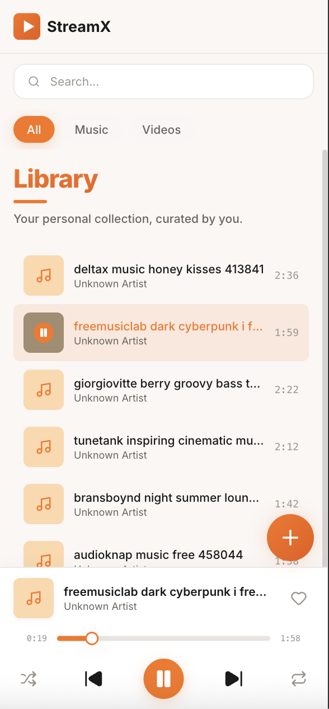

# StreamX

A self-hosted media streaming PWA for your personal music and video collection. Stream anywhere, on any device.


## Overview

StreamX is a modern, Spotify/Netflix-inspired media player that lets you stream your personal audio and video files from your own server. Built as a Progressive Web App (PWA), it works seamlessly on desktop and mobile devices with offline caching, lock screen controls, and native app-like experience.

### Screenshots

| Desktop | Mobile |
|---------|--------|
|  |  |

### Demo


## Features

- 🎵 **Audio & Video Streaming** - Play your personal media collection
- 📱 **PWA Support** - Install as a native app on iOS and Android
- 🔒 **Lock Screen Controls** - Control playback without unlocking your phone
- 💾 **Smart Caching** - Previously played tracks load instantly from cache
- 🎨 **Glass-Morphism UI** - Modern, polished design with smooth animations
- 📺 **Continue Watching** - Resume videos where you left off
- ❤️ **Favorites** - Like and organize your favorite tracks
- 🔀 **Shuffle & Repeat** - Full playback control with queue management
- 🐳 **Docker Ready** - Easy deployment with Docker Compose

## Prerequisites

- [Docker](https://docs.docker.com/get-docker/) and Docker Compose
- **[SelfDB](https://selfdb.io) (Official Version)** - StreamX requires the official version of SelfDB. If you don't have a copy, you must [purchase one from SelfDB](https://selfdb.io) before using StreamX.
- Your media files (MP3, MP4, M4A, WAV, FLAC, etc.)

> ⚠️ **Important:** StreamX is designed to work exclusively with the official version of SelfDB. Unofficial versions are not supported.

---

## Quick Start

### Step 1: Set Up SelfDB

#### 1.1 Create the Database Tables

In your SelfDB dashboard, navigate to the SQL editor and run the contents of [`tables.sql`](tables.sql):

```bash
# The file contains schemas for:
# - media         : Stores audio/video metadata
# - watch_progress: Tracks video playback position  
# - playback_state: Persists queue and player state
# - favorites     : Tracks liked media items
```

⚠️ **Important:** After creating the tables, you **must** make them **Public**:
1. Go to **Tables** in your SelfDB dashboard
2. For each table (`media`, `watch_progress`, `playback_state`, `favorites`), click the table settings
3. Toggle the **Public/Private** button to set it as **Public**
4. This allows the app to read and write data

#### 1.2 Create Storage Bucket

1. In SelfDB dashboard, go to **Storage**
2. Create a new bucket named `media-files`
3. **Important:** Set the bucket to **Public** by toggling the **Public/Private** button (required for streaming media files)

#### 1.3 Configure CORS Origins

StreamX needs to access your SelfDB instance from the browser, so you must configure CORS in your SelfDB `.env` file.

In your SelfDB instance's `.env` file, add your StreamX instance URL to the `CORS_ORIGINS` variable:

```env
CORS_ORIGINS=http://localhost:8000,http://localhost:3000,http://localhost:7034,https://yourdomain.com
```

| URL | Description |
|-----|-------------|
| `http://localhost:7034` | Default StreamX development port |
| `https://yourdomain.com` | Your production domain |

Make sure to include all domains/IPs where StreamX will be accessed from. After updating `.env`, restart your SelfDB instance for changes to take effect.

---

### Step 2: Configure Environment

Create a `.env` file in the project root:

```env
VITE_SELFDB_URL=http://localhost:8000
VITE_SELFDB_KEY=your-selfdb-api-key
```

| Variable | Description |
|----------|-------------|
| `VITE_SELFDB_URL` | Your SelfDB instance URL |
| `VITE_SELFDB_KEY` | Your SelfDB API key (from project settings) |

---

### Step 3: Start with Docker

```bash
# Build and start the container
docker compose up -d --build

# View logs
docker compose logs -f

# Stop the service
docker compose down
```

The app will be available at **http://localhost:7034**

> **Note:** Make sure SelfDB is running on port 8000 (or update `nginx.conf` to match your setup).

---

### Step 4: Install the PWA

#### On iPhone/iPad (Safari)

1. Open **http://your-server-ip:7034** in Safari
2. Tap the **Share** button (square with arrow)
3. Scroll down and tap **"Add to Home Screen"**
4. Name it "StreamX" and tap **Add**

#### On Android (Chrome)

1. Open **http://your-server-ip:7034** in Chrome
2. Tap the **three-dot menu** (⋮)
3. Tap **"Install app"** or **"Add to Home screen"**
4. Confirm the installation

#### On Desktop (Chrome/Edge)

1. Open **http://localhost:7034**
2. Click the **install icon** in the address bar (or menu → "Install StreamX")

---

## Usage

### Playing Music

1. Browse your library in the **Music** filter
2. Tap any track to start playback
3. Use the mini player at the bottom for controls
4. Tap the mini player to expand to full-screen view
5. Lock screen controls work automatically on mobile

### Watching Videos

1. Switch to **Videos** filter
2. Tap any video to start playback
3. Videos open in full-screen player with controls
4. Progress is saved automatically for "Continue Watching"

### Managing Favorites

1. Tap the **heart icon** on any track to add to favorites
2. Favorites are synced to the database
3. Access favorites from the sidebar (desktop)

---

## Development

### Local Development

```bash
# Install dependencies
bun install

# Start development server
bun run dev

# Build for production
bun run build
```

### Project Structure

```
StreamX/
├── src/
│   ├── components/
│   │   ├── AudioPlayer.tsx    # Music player with lock screen controls
│   │   ├── VideoPlayer.tsx    # Video player with fullscreen support
│   │   ├── MediaGrid.tsx      # Media library grid view
│   │   ├── Sidebar.tsx        # Navigation sidebar
│   │   └── UploadModal.tsx    # Media upload interface
│   ├── lib/
│   │   ├── selfdb.ts          # SelfDB client configuration
│   │   ├── playbackStore.ts   # Playback state management
│   │   ├── mediaCache.ts      # IndexedDB media caching
│   │   └── favorites.ts       # Favorites management
│   ├── hooks/
│   │   └── usePlayback.ts     # Media Session API hook
│   └── App.tsx                # Main application component
├── public/
│   ├── manifest.json          # PWA manifest
│   └── sw.js                  # Service worker for offline support
├── docker-compose.yml         # Docker orchestration
├── Dockerfile                 # Multi-stage build (Node + nginx)
├── nginx.conf                 # Nginx configuration with API proxy
└── tables.sql                 # Database schema
```

---

## Configuration

### Docker Compose

The default configuration runs on port **7034**. To change:

```yaml
# docker-compose.yml
ports:
  - "YOUR_PORT:7034"
```

### Nginx Proxy

The nginx configuration proxies `/api/` requests to SelfDB. If your SelfDB runs on a different port:

```nginx
# nginx.conf
location /api/ {
    proxy_pass http://host.docker.internal:YOUR_SELFDB_PORT/;
}
```

### Media Cache

StreamX caches played media in IndexedDB for faster subsequent playback:

| Setting | Value | Location |
|---------|-------|----------|
| Max cache size | 500MB | `src/lib/mediaCache.ts` |
| Eviction policy | Least recently accessed | Automatic |
| Clear cache | DevTools → Application → IndexedDB | Browser |

---

## Debugging & Testing

### Initial Setup Checklist

Before uploading media, verify your setup is correct:

1. **CORS Configuration**
   - [ ] Updated SelfDB `.env` with your StreamX instance URL in `CORS_ORIGINS`
   - [ ] Restarted SelfDB instance after updating `.env`
   - Check browser DevTools (F12 → Console) for CORS errors

2. **Public Access**
   - [ ] All tables are set to **Public** in SelfDB dashboard:
     - `media`
     - `watch_progress`
     - `playback_state`
     - `favorites`
   - [ ] `media-files` bucket is set to **Public**

3. **Test Upload**
   - Open StreamX and drag a media file into the drop zone (Sidebar)
   - Monitor the upload progress bar
   - Check browser console for errors if upload fails

### Common Debug Steps

#### If uploads fail immediately

1. Open **DevTools** (F12 on desktop, or use your browser's developer tools)
2. Go to **Console** tab
3. Look for errors starting with `CORS` or `403 Forbidden`
4. **Solution:** Check that CORS_ORIGINS includes your StreamX URL and SelfDB is restarted


---

## Troubleshooting

### Media won't play

1. Ensure the `media-files` bucket is set to **Public**
2. Check that file paths in the database match actual storage paths
3. Verify CORS is enabled on your SelfDB instance

### Lock screen controls not working

1. Make sure you're using the installed PWA (not browser)
2. On iOS, controls appear after audio starts playing
3. Try closing and reopening the app

### Docker can't connect to SelfDB

On macOS/Windows, Docker uses `host.docker.internal` to reach the host machine. On Linux, you may need to:

```bash
# Option 1: Use host network
docker run --network host ...

# Option 2: Use your machine's IP
# Update nginx.conf: proxy_pass http://192.168.x.x:8000/;
```

### PWA not installing

1. Ensure you're using HTTPS (or localhost)
2. Check that `manifest.json` is accessible at `/manifest.json`
3. Verify service worker registration in DevTools → Application

---

## Tech Stack

| Category | Technology |
|----------|------------|
| Frontend | React 19, TypeScript, Tailwind CSS 4 |
| Animations | Framer Motion |
| Backend | SelfDB (PostgreSQL + Storage) |
| Build | Vite 7, Bun |
| Deployment | Docker, nginx |
| PWA | Service Worker, Media Session API, IndexedDB |

---

## API Reference

### SelfDB Tables

See [`tables.sql`](tables.sql) for the complete database schema. Key tables:

| Table | Purpose |
|-------|---------|
| `media` | Stores audio/video metadata (title, artist, type, url, cover) |
| `favorites` | Tracks liked/favorited media items |
| `watch_progress` | Saves video playback position for "Continue Watching" |
| `playback_state` | Persists queue, shuffle, repeat settings |

---

## License

This project is licensed under the MIT License.

---

## Acknowledgments

- [SelfDB](https://selfdb.io) - Self-hosted backend
- [Lucide Icons](https://lucide.dev) - Beautiful icons
- [Tailwind CSS](https://tailwindcss.com) - Utility-first CSS
- [Framer Motion](https://www.framer.com/motion/) - Animations

---

## Legal Notice & Disclaimer

⚠️ **StreamX is intended for streaming media that you personally own.** Ensure you comply with your local copyright regulations.

**NO LIABILITY:** The creators, contributors, and maintainers of StreamX shall not be held liable for any legal consequences arising from the use or misuse of this software. This includes, but is not limited to, claims related to copyright infringement or intellectual property violations.

**PROVIDED "AS IS":** This software is provided "as is", without warranty of any kind, express or implied. The developers make no guarantees regarding functionality, security, or fitness for any particular purpose.

By using StreamX, you acknowledge that:
- You will only stream content you legally own or have rights to
- You accept all risks associated with using this software
- The developers assume no responsibility for how the software is used

See the [LICENSE](LICENSE) file for complete terms.
